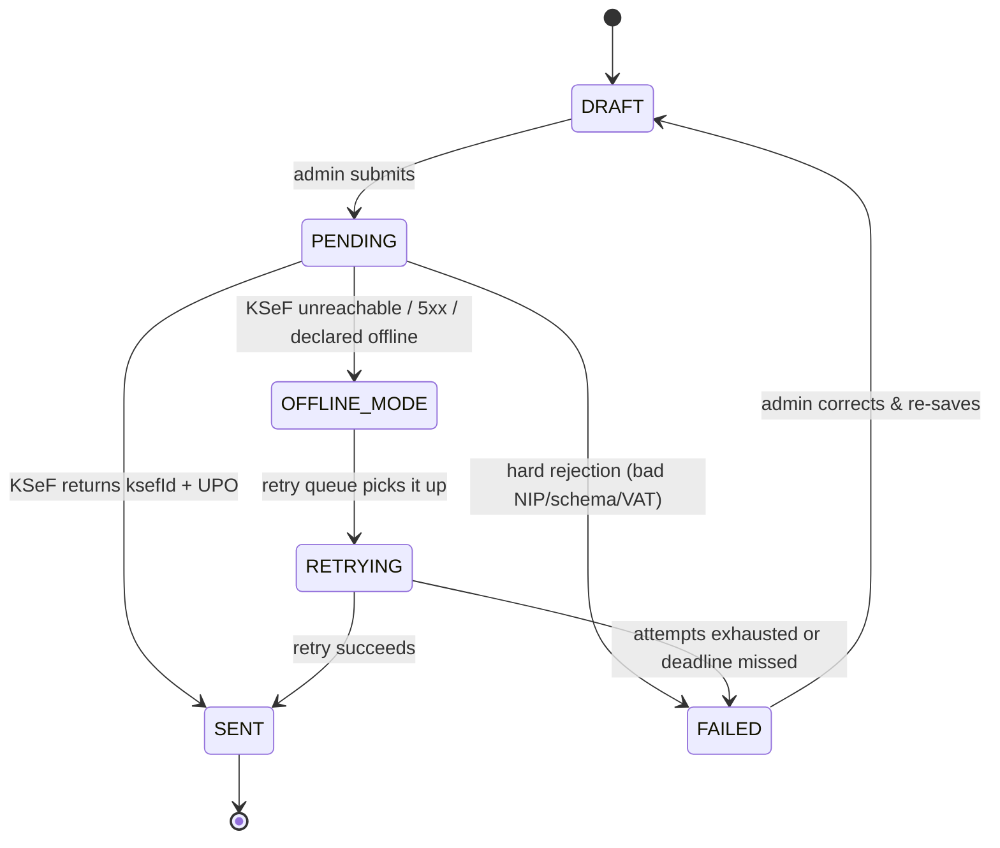
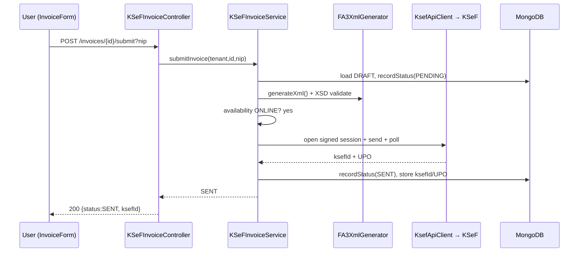
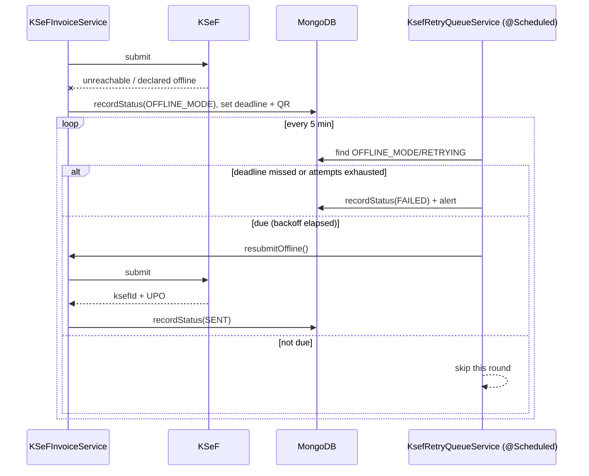

# Invoice Module — Developer Documentation

The Invoice module is the core of KSeFFlow: it lets a Polish company **create, submit, track, and
correct** structured invoices through the National e-Invoice System (**KSeF**). This document is the
single reference a new developer needs to understand the whole module — how it works **and why it is
built this way**.

> Companion docs: [integration.md](./integration.md) (KSeF availability/connection),
> [certificates.md](./certificates.md) (the certificate used to sign submissions),
> [received-invoices.md](./received-invoices.md) (purchase invoices), [permissions.md](./permissions.md).

---

## 1. Overview

An **invoice** in KSeFFlow is a structured, FA(3)-schema document that represents a sale. The module
covers its **entire lifecycle**:

1. **Create** a draft locally (in our MongoDB).
2. **Generate** the official FA(3) XML from the draft.
3. **Submit** it to the government KSeF API (signed with the tenant's certificate).
4. On success, store the KSeF number + **UPO** (official receipt); on failure, **park it offline** and
   retry automatically before the legal deadline.
5. **Track** the invoice's status timeline, **download** the XML/PDF, and **issue corrections**.

The module is split across a Spring Boot backend (business logic + KSeF integration + MongoDB) and a
React frontend (the issuing form, the invoice repository list, and the status timeline).

---

## 2. Why this module is needed

**Business problem.** From **1 February 2026**, Polish VAT law makes KSeF mandatory: companies must
issue invoices as structured FA(3) documents through the government system, not as free-form PDFs.
A non-compliant invoice is not legally valid. Doing this by hand is error-prone (strict XML schema,
exact VAT maths, certificate-signed sessions, legal deadlines).

**What the module solves / its benefits.**
- **Compliance**: produces schema-valid FA(3) XML and submits it the way KSeF requires.
- **Business continuity**: when KSeF is down, invoices are still *issued* (offline mode) and delivered
  later within the legal window — the business never stops invoicing.
- **Auditability**: an immutable status timeline + audit log + tamper-evident XML hash, retained for
  the legally required 10 years.
- **Correctness**: `BigDecimal` money maths (no floating-point VAT errors), server-side validation,
  and a single source of truth for the official XML.
- **Usability**: a guided issuing form, a friendly status ("what to do next"), and downloadable
  XML/PDF — so non-technical accountants can operate it.

---

## 3. Use cases

| Actor | Use case |
|---|---|
| Accountant / Case Manager | Create a draft invoice, review it, submit it to KSeF. |
| Accountant / Case Manager | Issue a **correction** (faktura korygująca) for an invoice already in KSeF. |
| Company Admin | Everything a Case Manager can do, plus full module control. |
| Compliance Officer / Auditor | **Read-only**: browse invoices, inspect XML, view the status timeline and audit trail, export. |
| System (background job) | Automatically retry offline/parked invoices until they reach KSeF or hit their deadline. |
| Any issuer | Download the official **FA(3) XML** and a human-readable **PDF** of an invoice. |

---

## 4. User flow (end to end)

```
Create draft ──► Review ──► Submit ──┬─► KSeF reachable + accepted ──► SENT (KSeF number + UPO)
   (DRAFT)                           │
                                     ├─► KSeF unavailable / declared offline ──► OFFLINE_MODE
                                     │        └─► background retry queue ──► RETRYING ──► SENT
                                     │                                          └─► (deadline/attempts) ──► FAILED
                                     └─► KSeF hard-rejects (bad data) ──► FAILED ──► (correct) ──► DRAFT
```

1. **Create** — the user fills the issuing form (seller is snapshotted from the tenant; buyer, dates,
   line items with VAT rates, payment). "Save as draft" stores it as **DRAFT**.
2. **Edit** — only a **DRAFT** is editable. Once submitted (any other status), the detail page is
   **read-only**; to change a processed invoice you issue a **correction**.
3. **Submit** — "Sign & submit to KSeF" generates the FA(3) XML, validates it, opens a signed KSeF
   session, and sends it. Result is one of SENT / OFFLINE_MODE / FAILED.
4. **Manage** — the repository list shows every invoice with a friendly status; the detail page shows
   the status timeline + "next step", and offers XML/PDF download and (for SENT) corrections.

Frontend entry points: list = [`InvoiceList.jsx`](../frontend/src/components/InvoiceList.jsx),
create/view/edit = [`InvoiceForm.jsx`](../frontend/src/components/InvoiceForm.jsx),
timeline = [`InvoiceStatusTimeline.jsx`](../frontend/src/components/InvoiceStatusTimeline.jsx).

---

## 5. System architecture

```
┌──────────────────────────── Frontend (React, :3001) ───────────────────────────┐
│  InvoiceForm.jsx (create/edit/view, XML & PDF tabs)                             │
│  InvoiceList.jsx (server-paginated repository) · InvoiceStatusTimeline.jsx      │
│  api/ksefApi.js  ──►  lib/api.js ksefFetch (httpOnly cookie auth)               │
└───────────────────────────────────────┬─────────────────────────────────────────┘
                                         │  /api/v1/invoices/**   (cookie)
                                         ▼
┌──────────────────────────── Backend (Spring Boot, :8081) ──────────────────────┐
│  KSeFInvoiceController  ── permission gate (AuthenticatedUser) ──► KSeFInvoiceService
│        │                                                                         │
│        ▼                                                                         │
│  KSeFInvoiceService  ── orchestrates the pipeline ──┐                            │
│     ├─ FA3XmlGeneratorService → FA3XmlBuilder/Serializer (official FA(3) XML)    │
│     ├─ Fa3ValidationGate (XSD check)                                             │
│     ├─ KSeFAuthService + KsefApiClient (signed KSeF session + submit)            │
│     ├─ KsefAvailabilityService (online/offline/emergency mode)                   │
│     ├─ UPOStorageService / KsefQrService (UPO + offline QR codes)                │
│     └─ KsefRetryQueueService (@Scheduled background retries)                     │
│        │                                                                         │
│        ▼                                                                         │
│  KsefInvoiceRepository (Spring Data) + MongoTemplate (flexible list query)       │
└───────────────────────────────────────┬─────────────────────────────────────────┘
                                         ▼                       ▼
                                    MongoDB                Government KSeF API
                              (ksef_invoices, …)     (auth + sessions + invoices)
```

- **Auth**: the browser holds an httpOnly `idToken` cookie. `ksefFetch` sends it; the backend resolves
  the caller + tenant from it (via RegulaOne) into an `AuthenticatedUser`. The tenant is **never** taken
  from a client header.
- **Tenant isolation**: every query filters by `tenantId`.
- The frontend never talks to KSeF directly — only the backend does (it holds the certificate).

---

## 6. Database design (MongoDB)

### 6.1 Why MongoDB

- An invoice is a **document aggregate**: header + N line items + a status history. These are always
  read and written together and never queried independently, so embedding them in one document
  (rather than 3 joined SQL tables) matches the access pattern and avoids joins.
- The FA(3) shape is **deeply nested and evolving** (schema versions, optional blocks like
  corrections/attachments). A flexible document model absorbs new optional fields without migrations.
- Reads are tenant-scoped lists with optional filters — served by a single compound index.

### 6.2 Collections

The Invoice module's primary collection is **`ksef_invoices`**. Related data lives in its own
collections owned by other modules (documented separately):

| Collection | Owner | Purpose |
|---|---|---|
| **`ksef_invoices`** | this module | The invoice aggregate (header + embedded items + status history). |
| `ksef_audit_logs` | audit | Immutable audit entries for every critical invoice action. |
| `ksef_received_invoices` | received-invoices | Purchase invoices pulled from KSeF (see its doc). |
| `ksef_availability` | integration | Global KSeF online/offline/emergency state (see its doc). |
| `ksef_certificates` | certificates | Certificate metadata used to sign submissions (see its doc). |

Within `ksef_invoices`, **`items`** (`InvoiceItem`) and **`statusHistory`** (`StatusHistoryEntry`) are
**embedded sub-documents**, not separate collections.

### 6.3 `ksef_invoices` — field reference

Model: [`KsefInvoice.java`](../backend/src/main/java/com/ksefflow/backend/models/KsefInvoice.java).
Money is **`BigDecimal`** everywhere (Polish accounting law forbids float rounding errors).

**Identity & tenancy**

| Field | Type | Notes |
|---|---|---|
| `id` | String | `@Id` Mongo ObjectId (string). |
| `tenantId` | String | `@Indexed`. References RegulaOne `Tenant._id` (plain string — separate service, no `@DBRef`). **Every query filters on this.** |
| `invoiceNumber` | String | `@Indexed`. FA(3) number `FV/YYYY/MM/SEQUENCE`, unique within a tenant. |
| `issueDate` | LocalDate | Required. FA(3) `P_1`. |
| `dueDate` | LocalDate | Optional payment due date. |

**Seller (snapshot at creation)** — `sellerName`, `sellerNip` (10-digit), `sellerAddress`,
`sellerPostalCode`, `sellerCity`. Snapshotted because the tenant's details may change later, but an
issued invoice must preserve the seller exactly as at issue time.

**Buyer** — `buyerName`, `buyerNip` (10-digit), `buyerAddress`, `buyerPostalCode`, `buyerCity`.

**Financials**

| Field | Type | Notes |
|---|---|---|
| `currency` | `KsefCurrency` (enum) | Default `PLN`. |
| `exchangeRate` | BigDecimal | Required by KSeF only when currency ≠ PLN (FA(3) `KursWalutyZ`). |
| `exemptionLegalBasis` | String | Required when any line is VAT-exempt (`zw`) — FA(3) `P_19A`. |
| `totalNet` / `totalVat` / `totalGross` | BigDecimal | Document totals. |
| `paymentMethod` | `KsefPaymentMethod` (enum) | e.g. split payment, transfer. |
| `bankAccount` | String | IBAN; required when payment method is split payment. |
| `paymentStatus` | `KsefPaymentStatus` (enum) | Default `UNPAID`. |
| `notes` | String | Free-text FA(3) annotation. |
| `items` | `List<InvoiceItem>` | Embedded line items (see 6.4). |

**KSeF submission state**

| Field | Type | Notes |
|---|---|---|
| `status` | `KsefInvoiceStatus` (enum) | Default `DRAFT`. The lifecycle state (see §8). |
| `statusHistory` | `List<StatusHistoryEntry>` | Append-only timeline; never edited/removed (audit). |
| `ksefId` | String | Official KSeF reference, set on `SENT`. `{NIP}-{YYYYMMDD}-{hex}`. |
| `upoStatus` | `KsefUpoStatus` (enum) | Default `NONE`. |
| `upoTimestamp` | LocalDateTime | From the UPO XML — legally significant. |
| `upoDocumentId` | String | Ref to the UPO doc in encrypted S3. |

**Offline / compliance**

| Field | Type | Notes |
|---|---|---|
| `offlineMode` | `KsefOfflineMode` (enum) | Drives the legal deadline (unavailability → next business day; emergency → 7 business days). |
| `offlineIssuedAt` | LocalDateTime | First offline issue time; set once, retained even after later registration. |
| `ksefSubmissionDeadline` | LocalDateTime | Legal deadline to reach KSeF; a breach is escalated. |
| `qrCodeInvoice` | String | CODE I QR ("OFFLINE") — buyer verifies content. |
| `qrCodeCertificate` | String | CODE II QR ("CERTYFIKAT") — issuer identity, sealed with the cert. |
| `submissionAttempts` | int | Default 0; drives backoff + the attempts safety stop. |
| `lastErrorMessage` | String | Last KSeF/HTTP error (shown to admins/audit, not to end users). |
| `lastRetryAt` | LocalDateTime | Most recent attempt — input to backoff. |
| `nextRetryAt` | LocalDateTime | **`@Transient`** — computed on read, not stored (next eligible retry time). |

**Correction (faktura korygująca)** — `correction` (bool, default false), `correctedInvoiceId`
(internal link), `correctedKsefNumber`, `correctedInvoiceNumber`, `correctedIssueDate`,
`correctionReason`, `correctionType` (1/2/3). Populate the FA(3) `DaneFaKorygowanej` block.

**XML & metadata** — `fa3XmlHash` (SHA-256 of the submitted XML, tamper-evidence),
`fa3XmlStoragePath` (encrypted S3 path, 10-year retention), `ksefEnvironment`
(`SANDBOX`/`PRODUCTION` — sandbox invoices must never appear in tax records),
`submittedToKsefAt`, `receivedFromKsefAt` (SLA timing).

**Ownership & audit** — `createdByUserId`, `lastModifiedByUserId`, `createdAt`, `updatedAt`,
`softDeleted` (default false — invoices are **never hard-deleted**, 10-year retention), `deletedAt`.

### 6.4 Embedded: `InvoiceItem`

| Field | Type | Notes |
|---|---|---|
| `itemId` | String | Line identifier. |
| `productName` | String | Goods/service name (FA(3) `P_7`). |
| `quantity` | BigDecimal | Default 1. |
| `unitPrice` | BigDecimal | Net unit price. |
| `vatRate` | `KsefVatRate` (enum) | Default `VAT_23` (23/8/5/0/zw). |
| `netAmount` | BigDecimal | `unitPrice × quantity`. |
| `vatAmount` | BigDecimal | `netAmount × vatRate multiplier`. |
| `grossAmount` | BigDecimal | `netAmount + vatAmount`. |
| `unit` | String | e.g. `szt.`. |
| `pkwiuCode` | String | Optional classification code. |

### 6.5 Embedded: `StatusHistoryEntry`

`status` (`KsefInvoiceStatus`), `timestamp` (LocalDateTime), `note` (String), `changedBy` (String —
user email or `system@ksefflow`). Appended by `recordStatus(...)` at every transition.

### 6.6 Indexes

- `@Indexed` on `tenantId` and `invoiceNumber`.
- `@CompoundIndex {tenantId:1, status:1, createdAt:-1}` — powers the tenant-scoped, status-filtered,
  newest-first list query (the most common read).

---

## 7. API documentation

Base path: **`/api/v1/invoices`** — [`KSeFInvoiceController.java`](../backend/src/main/java/com/ksefflow/backend/controllers/KSeFInvoiceController.java).
Auth: httpOnly `idToken` cookie → `AuthenticatedUser` (tenant resolved server-side).
Permission codes (KSeF): `KSEF_TENANT_ADMIN`, `KSEF_CASE_MANAGER`, `KSEF_COMPLIANCE_OFFICER`,
`KSEF_AUDITOR` (see [permissions.md](./permissions.md)).

| Method & path | Permission | Purpose |
|---|---|---|
| `POST /draft` | TENANT_ADMIN, CASE_MANAGER | Create (or update) a DRAFT invoice. |
| `POST /{id}/submit?nip=` | TENANT_ADMIN, CASE_MANAGER | Run the submission pipeline. |
| `POST /{id}/correct?reason=&correctionType=` | TENANT_ADMIN, CASE_MANAGER | Create a correction draft from a SENT invoice. |
| `POST /{id}/retry` | TENANT_ADMIN, CASE_MANAGER | Manually retry an OFFLINE_MODE/FAILED invoice now. |
| `GET /{id}` | TENANT_ADMIN, CASE_MANAGER, COMPLIANCE_OFFICER, AUDITOR | Fetch one invoice. |
| `GET /{id}/status` | read roles | Status timeline + current label + "next step". |
| `GET /{id}/xml` | read roles | The exact official FA(3) XML (`application/xml`). |
| `GET /?status=&search=&page=&size=&sort=` | read roles | Server-paginated, filtered, searchable list. |

### 7.1 `POST /draft`

Validated body — [`CreateInvoiceRequest`](../backend/src/main/java/com/ksefflow/backend/dto/CreateInvoiceRequest.java):

```jsonc
{
  "invoiceNumber": "FV/2026/05/0001",   // @Pattern FV/YYYY/MM/SEQUENCE, required
  "issueDate": "2026-05-20",            // required
  "dueDate": "2026-06-03",
  "sellerName": "DSV TEAM", "sellerNip": "1234056789",   // NIP @Pattern \d{10}
  "sellerAddress": "…", "sellerPostalCode": "47-852", "sellerCity": "…",
  "buyerName": "…", "buyerNip": "5229983144",
  "buyerAddress": "…", "buyerPostalCode": "00-345", "buyerCity": "…",
  "currency": "PLN",
  "totalNet": 2950.00,                  // @DecimalMin 0.00
  "totalVat": 566.00,
  "totalGross": 3516.00,                // @DecimalMin 0.01 (must be positive)
  "paymentMethod": "SPLIT_PAYMENT", "bankAccount": "PL89…",
  "items": [ { "productName": "…", "quantity": 1, "unitPrice": 2200.00, "vatRate": "VAT_23" } ]
}
```

`201 Created` → the saved `KsefInvoice` (status `DRAFT`). If a DRAFT with the same `invoiceNumber`
exists it is updated; a finalized duplicate is rejected.

### 7.2 `POST /{id}/submit?nip={10-digit}`

No body; `nip` is the tenant's own NIP (the KSeF auth context). Returns `SubmitInvoiceResponse`:

```jsonc
// 200 OK  — accepted in real time
{ "invoiceId": "…", "invoiceNumber": "FV/2026/05/0001", "status": "SENT",
  "ksefId": "1234056789-20260520-A1B2…", "message": "Invoice successfully submitted to KSeF — reference: …" }

// 202 Accepted — KSeF unavailable / declared offline → queued
{ "invoiceId": "…", "status": "OFFLINE_MODE",
  "message": "KSeF unavailable — invoice queued for retry (offline mode)" }
```

HTTP status mirrors the result: `SENT` → 200; otherwise → 202.

### 7.3 `GET /{id}/status`

```jsonc
{
  "currentStatus": "OFFLINE_MODE",
  "currentStatusLabel": "Offline (queued)",
  "nextStep": "KSeF was unavailable, so the invoice is queued and will be retried automatically…",
  "history": [
    { "status": "DRAFT", "statusLabel": "Draft", "timestamp": "2026-05-20T12:03:00", "note": "Invoice created as draft", "changedBy": "ankit@dsvcorp.com.au" },
    { "status": "PENDING", "statusLabel": "Pending", "timestamp": "2026-05-20T12:03:05", "note": "Submitted to KSeF (attempt 1)", "changedBy": "ankit@…" },
    { "status": "OFFLINE_MODE", "statusLabel": "Offline (queued)", "timestamp": "2026-05-20T12:03:06", "note": "KSeF unavailable — queued offline (deadline …)", "changedBy": "system@ksefflow" }
  ]
}
```

### 7.4 `GET /?status=&search=&page=&size=&sort=`

Server-side pagination + filter + search. `status` is a `KsefInvoiceStatus` (omit for all); `search`
matches `invoiceNumber` / `buyerName` / `buyerNip` (case-insensitive); returns a Spring Data `Page`
(`content`, `totalElements`, `totalPages`, `number`, `size`), always newest-first.

### 7.5 Error responses

| HTTP | When |
|---|---|
| `400 Bad Request` | Validation failure — DTO constraints, bad NIP/number pattern, malformed XML/VAT. Body = message. |
| `403 Forbidden` | Caller lacks the required permission. |
| `404 / 400` | Invoice not found for the tenant (thrown as `IllegalArgumentException` → 400 with message). |
| `409 Conflict` | Illegal state transition (e.g. submitting a non-DRAFT) — `IllegalStateException`. |
| `202 Accepted` | Not an error: submission accepted but queued offline. |

Errors are returned as plain messages by the controller's `@ExceptionHandler`s; raw KSeF/stack traces
are never exposed to end users (they go to logs + audit).

---

## 8. Business logic

### 8.1 Statuses & state transitions

Defined in [`KsefInvoiceStatus`](../backend/src/main/java/com/ksefflow/backend/models/utils/KsefInvoiceStatus.java).
Each status carries a `label` and a plain-language `nextStep`.



Transitions are recorded via `recordStatus(...)`, which sets the status, stamps `updatedAt`, and
appends an immutable `StatusHistoryEntry`.

### 8.2 Validation rules

1. **DTO layer** (`CreateInvoiceRequest`): required fields; `invoiceNumber` matches `FV/YYYY/MM/SEQ`;
   seller/buyer NIP `\d{10}`; `totalNet ≥ 0`, `totalGross > 0`. Frontend validation is **never trusted** —
   the server re-validates.
2. **Build layer** (`FA3XmlBuilder`): pre-flight checks (invoice number present, seller NIP present,
   etc.) before constructing the DOM.
3. **Schema layer** (`Fa3ValidationGate`): validates the generated XML against the official FA(3) XSD
   when `ksef.validation.xsd.enabled=true`. KSeF also validates server-side.
4. **Business rules**: `exchangeRate` required for non-PLN; `exemptionLegalBasis` required if any line
   is `zw`; `bankAccount` required for split payment.

### 8.3 Submission pipeline (`submitInvoice`)

[`KSeFInvoiceService.submitInvoice(...)`](../backend/src/main/java/com/ksefflow/backend/services/KSeFInvoiceService.java):

1. Load the DRAFT (tenant-scoped); increment `submissionAttempts`; record `PENDING`.
2. Audit `INVOICE_SUBMISSION_STARTED`.
3. Generate FA(3) XML + validate. On failure → publish `INVOICE_VALIDATION_ERROR`, rethrow (400).
4. Save the XML SHA-256 hash.
5. **Special-mode guard**: if `KsefAvailabilityService` is **not** ONLINE (EMERGENCY/UNAVAILABILITY),
   **skip the live call** and route straight to offline issuance (per MF "tryby szczególne" rules).
6. Otherwise attempt `executeKsefSubmission` (open signed session → send → poll → store UPO).
   - Success → record `SENT`, store `ksefId`/UPO, publish `INVOICE_SENT`.
   - `KsefSubmissionException`/`KsefAuthException` → `handleOfflineMode(...)`: record `OFFLINE_MODE`,
     stamp `offlineMode`/`offlineIssuedAt`/`ksefSubmissionDeadline`, seal QR codes, publish
     `INVOICE_SUBMISSION_FAILED`.

### 8.4 Offline retry, failures, edge cases

Background job [`KsefRetryQueueService.processOfflineQueue`](../backend/src/main/java/com/ksefflow/backend/services/retry/KsefRetryQueueService.java)
runs on `@Scheduled(fixedDelay = ksef.retry.interval-ms, default 300000 = 5 min)`:

1. Collect all `OFFLINE_MODE` + `RETRYING` invoices **across all tenants**.
2. For each:
   - **Deadline missed** (`now > ksefSubmissionDeadline`, still not sent) → mark `FAILED`, audit, alert.
   - **Attempts exhausted** (`submissionAttempts ≥ ksef.retry.max-attempts`) → mark `FAILED`, alert (safety stop).
   - **Not due yet** (inside backoff window) → skip this round.
   - Otherwise → `resubmitOffline(...)`; on success `SENT` + `INVOICE_SENT`, else stay queued + `INVOICE_SUBMISSION_FAILED`.

**Backoff** — [`KsefRetryScheduleCalculator`](../backend/src/main/java/com/ksefflow/backend/services/retry/KsefRetryScheduleCalculator.java):
`nextEligibleAt = lastRetryAt + base × 2^(attempts-1)`, capped at max
(`ksef.retry.base-backoff-seconds=60`, `ksef.retry.max-backoff-seconds=3600`). Never retried →
due now. The same calculator populates the **transient** `nextRetryAt` on reads so the UI can show
"next automatic retry at …".

**Legal deadlines** (set at offline issuance from the availability mode): unavailability/offline24 →
**next business day**; emergency → **7 business days** (Polish VAT Act art. 106nda / 106nf).

**Edge cases**: submitting a non-DRAFT (blocked — only DRAFT is editable/submittable); KSeF reachable
but rejects (→ FAILED, manual correction); restart mid-emergency (availability state is persisted, see
[integration.md](./integration.md)); sandbox vs production (`ksefEnvironment` recorded; sandbox has no
legal effect).

---

## 9. Developer guide

### 9.1 Project structure (Invoice-relevant)

```
backend/src/main/java/com/ksefflow/backend/
├── controllers/KSeFInvoiceController.java        # REST endpoints + permission gates
├── services/
│   ├── KSeFInvoiceService.java                   # orchestration: create/submit/correct/retry/list/xml
│   ├── fa3xml/FA3XmlGeneratorService.java        # generate + hash the FA(3) XML
│   ├── fa3xml/FA3XmlBuilder.java                  # invoice → FA(3) DOM (official structure)
│   ├── fa3xml/FA3XmlSerializer.java              # DOM → UTF-8 string
│   ├── fa3xml/Fa3ValidationGate.java             # XSD validation
│   ├── retry/KsefRetryQueueService.java          # @Scheduled offline retry job
│   ├── retry/KsefRetryScheduleCalculator.java    # exponential-backoff maths (shared)
│   ├── KsefAvailabilityService.java              # online/offline/emergency mode
│   ├── ksefauth/KSeFAuthService.java, KsefApiClient.java   # signed KSeF session + calls
│   └── UPOStorageService.java, KsefQrService.java
├── models/KsefInvoice.java                        # aggregate + InvoiceItem + StatusHistoryEntry
│   └── models/utils/KsefInvoiceStatus.java, Ksef{VatRate,Currency,PaymentMethod,OfflineMode,…}.java
├── repository/KsefInvoiceRepository.java          # Spring Data Mongo
└── dto/CreateInvoiceRequest.java, dto/SubmitInvoiceResponse.java, dto/InvoiceStatusResponse.java

frontend/src/
├── components/InvoiceForm.jsx                     # create/edit/view + XML & PDF tabs
├── components/InvoiceList.jsx                     # paginated repository list + inspector
├── components/InvoiceStatusTimeline.jsx           # status + next step + history
├── components/CorrectionModal.jsx                 # issue a correction
├── api/ksefApi.js                                 # listInvoicesPage/getInvoice/getInvoiceXml/createInvoice/submitInvoice/…
└── lib/invoiceStatus.js                           # friendly status labels/hints (UI only)
```

### 9.2 Layering (always follow)

`Controller → Service → Repository/Domain → MongoDB`. Controllers are thin: resolve `AuthenticatedUser`,
check permissions, delegate. **No business logic or DB access in controllers.** KSeF calls live behind
`KsefApiClient`; XML behind the `fa3xml` package; backoff maths only in `KsefRetryScheduleCalculator`.

### 9.3 How to add / change functionality

- **New invoice field**: add to `KsefInvoice` (+ `CreateInvoiceRequest` if user-supplied) → map in
  `FA3XmlBuilder` if it goes into the XML → surface in `InvoiceForm` → map in `ksefApi.mapBackendInvoice`.
- **New endpoint**: add to `KSeFInvoiceController` with a `requireAnyPermission(...)` gate calling the
  exact codes; implement in `KSeFInvoiceService`; add a typed function in `ksefApi.js`.
- **Change retry behavior**: edit `KsefRetryScheduleCalculator` / `KsefRetryQueueService` and the
  `ksef.retry.*` properties — never duplicate the backoff formula elsewhere.
- **New status**: extend `KsefInvoiceStatus` (with `label` + `nextStep`), update the transition table,
  add a friendly label in `lib/invoiceStatus.js`.

### 9.4 Conventions & best practices

- Money is **`BigDecimal`** only — never `double`/`float`.
- Status changes go through `recordStatus(...)` (keeps the history append-only).
- Permission gating is **inline** at each endpoint: `caller.requireAnyPermission(<exact codes>)`.
- Comments are written in simple language (see CLAUDE.md §25); explain *why*, not just *what*.
- The frontend mirrors backend permissions (`lib/permissions.js`) only to hide controls — the backend
  is the real guard.
- Configuration over constants: `ksef.api.*`, `ksef.retry.*`, `ksef.validation.xsd.enabled`,
  `ksef.xml.dump.*`.

---

## 10. Security considerations

- **Authentication**: httpOnly `idToken` cookie only; resolved into `AuthenticatedUser` server-side.
  No client-asserted identity/tenant. Silent refresh-then-retry on 401 (`ksefFetch`).
- **Authorization**: per-endpoint `requireAnyPermission(...)`; write actions (draft/submit/correct/
  retry) = TENANT_ADMIN/CASE_MANAGER; reads = + COMPLIANCE_OFFICER/AUDITOR.
- **Tenant isolation**: every query filters `tenantId`; cross-tenant access is impossible by construction.
- **Data validation**: server-side DTO validation + FA(3) build checks + XSD gate; NIP/number regex;
  positive-amount constraints. Frontend validation is convenience only.
- **Sensitive data**: invoices are **soft-deleted** (10-year retention); FA(3) XML archived **encrypted
  in S3**; UPO stored encrypted; the signing certificate never leaves the server; `fa3XmlHash`
  provides tamper-evidence. **Raw KSeF errors/stack traces are never shown to end users** (logs/audit
  only). Sandbox vs production is recorded so test invoices can't pollute tax records.
- **Auditability**: immutable `statusHistory` + `ksef_audit_logs` for every critical action.

---

## 11. Sequence diagrams

### 11.1 Online submission (happy path)



### 11.2 Offline fallback + automatic retry



---

## 12. Future enhancements

- **True grand-total aggregates** on the list (sum of net/VAT/gross across all matching pages) via a
  Mongo aggregation endpoint (today the list sums only the current page).
- **Server-side bulk operations** (bulk submit/retry, CSV/JSON import of drafts).
- **Holiday-aware deadlines**: the next-business-day calculation currently skips weekends only; add the
  Polish public-holiday calendar for exact legal cutoffs.
- **Webhook/SSE status push** instead of the UI polling `/status`.
- **Attachments** (FA(3) `Zalacznik`) and more correction-type automation.
- **Configurable invoice-number sequencing** per tenant (server-generated, gap-free).
- **Metrics/alerting** on retry exhaustion and approaching deadlines (Prometheus/Grafana).

---

## 13. Quick recap

The Invoice module turns a locally-saved **draft** into a legally-valid **FA(3) e-invoice** in KSeF.
It is a thin controller → orchestrating service → Mongo (`ksef_invoices`, with embedded items + status
history) design, with the official XML built by the `fa3xml` package and submitted via a
certificate-signed session. When KSeF is unavailable it **issues offline and retries automatically with
exponential backoff before the legal deadline**, and it keeps an immutable, auditable trail throughout.
Money is `BigDecimal`, tenants are isolated on every query, only DRAFTs are editable, and raw technical
errors are kept away from end users.
