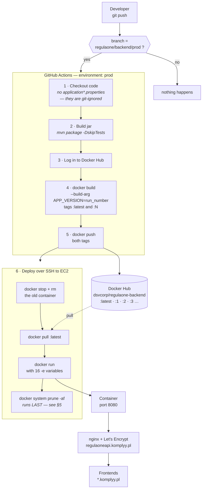
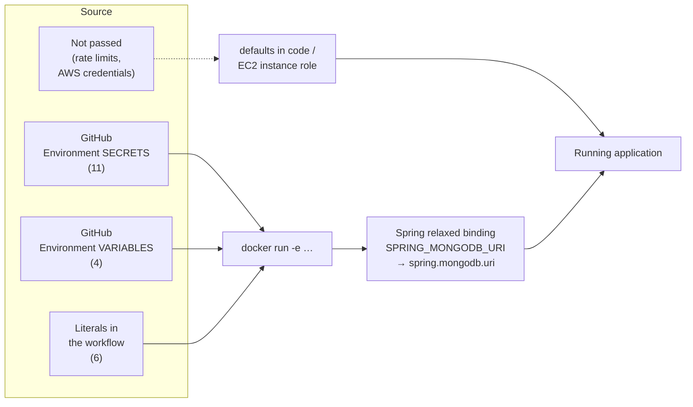
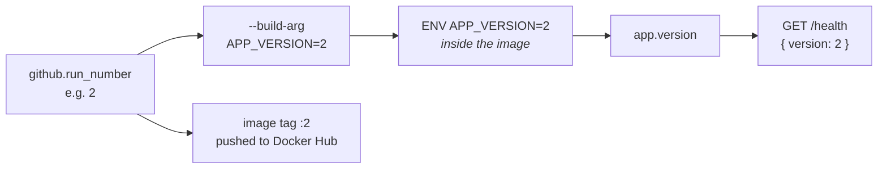
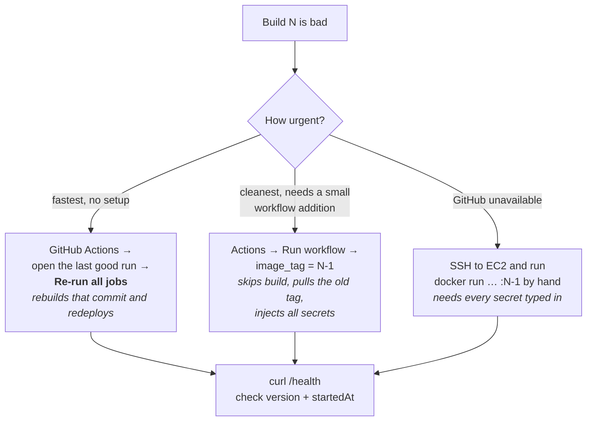
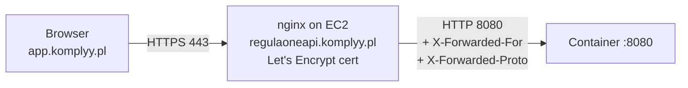

# RegulaOne backend — deployment pipeline

How a commit becomes the running production service, how to tell which build is live, and
how to go back to an earlier one.

**Pipeline file:** `.github/workflows/regulaone-backend.yml`
**Trigger:** a push to the `regulaone/backend/prod` branch
**Target:** a single EC2 instance (Amazon Linux 2023) running the image in Docker

---

## 1. The whole path, end to end



---

## 2. Where every setting comes from

The image ships with **no configuration at all**. All three `application*.properties` files
are git-ignored, so the CI checkout has none of them and nothing is baked in. Every setting
arrives as an environment variable at `docker run`.



**Why the names differ.** A GitHub secret keeps a short name shared across all the module
apps (`MONGODB_URI`); the environment variable must be named after the Spring property the
application actually reads (`SPRING_MONGODB_URI`). The workflow maps one to the other.

| GitHub secret | `-e` variable | Spring property |
|---|---|---|
| `MONGODB_URI` | `SPRING_MONGODB_URI` | `spring.mongodb.uri` |
| `COGNITO_REGION` | `AWS_COGNITO_REGION` | `aws.cognito.region` |
| `COGNITO_USER_POOL_ID` | `AWS_COGNITO_USER_POOL_ID` | `aws.cognito.user-pool-id` |
| `COGNITO_CLIENT_ID` | `AWS_COGNITO_CLIENT_ID` | `aws.cognito.client-id` |
| `COGNITO_CLIENT_SECRET` | `AWS_COGNITO_CLIENT_SECRET` | `aws.cognito.client-secret` |
| `NOTIFICATION_INTERNAL_TOKEN` | `NOTIFICATION_INTERNAL_SERVICE_TOKEN` | `notification.internal.service-token` |

| GitHub variable | `-e` variable | Spring property |
|---|---|---|
| `NOTIFICATION_FROM_EMAIL` | `APP_NOTIFICATIONS_FROM` | `app.notifications.from` |
| `CORS_ALLOWED_ORIGINS` | `CORS_ALLOWED_ORIGINS` | `cors.allowed-origins` |
| `SSO_COOKIE_DOMAIN` | `SSO_COOKIE_DOMAIN` | `sso.cookie.domain` |
| `SSO_CENTRAL_LOGIN_URL` | `SSO_CENTRAL_LOGIN_URL` | `sso.central-login-url` |

**Literal in the workflow, deliberately:** `SPRING_PROFILES_ACTIVE=prod`,
`SSO_COOKIE_SECURE=true`, `SSO_COOKIE_SAME_SITE=Lax`, `SPRINGDOC_API_DOCS_ENABLED=false`,
`SPRINGDOC_SWAGGER_UI_ENABLED=false`, `NOTIFICATION_TEST_ENABLED=false`.

These are security flags. An undefined GitHub variable renders as an **empty string** with
no warning, which would silently turn the protection off — so changing one has to be a
reviewed pull request, not a web form.

**Not passed at all:** the three `security.rate-limit.*` settings (their defaults in code
are already the production values) and the AWS credentials (the EC2 **instance role**
supplies them, which is better than a key pair because it rotates itself).

---

## 3. Versioning — what "version 2" means

`APP_VERSION` is GitHub's **run number**, passed as a Docker build argument, baked into the
image, and reported by `GET /health`.



It goes up by one on every workflow run, so nobody edits a version file. Because it is
baked into the **image** rather than passed at `docker run`, restarting the container by
hand still reports the build it was made from.

Note it counts **workflow runs, not deployments** — a failed run consumes a number, so
expect gaps (…40, 42, 45). They are identifiers, not a count.

---

## 4. Confirming what is live

```bash
curl https://regulaoneapi.komplyy.pl/health
```

```json
{
  "status": "ok",
  "environment": "prod",
  "version": "2",
  "startedAt": "7 Aug 2026, 08:54:35 CEST",
  "uptime": "49s"
}
```

| Field | What it proves |
|---|---|
| `environment` | `SPRING_PROFILES_ACTIVE=prod` actually landed. `dev` or `default` means it did not. |
| `version` | which build is running — cross-check against the Actions run number |
| `startedAt` | when this container started; **if it keeps changing, the container is crash-looping** |
| `uptime` | same signal, easier to read at a glance |

**This endpoint does not check the database.** Spring Data connects lazily, so it answers
`ok` even when MongoDB is unreachable. Only an actual sign-in exercises Cognito, Mongo and
the session cookie together.

---

## 5. Why `docker system prune -af` runs last

`prune -a` removes every image not used by a **running** container. Position is not
cosmetic:

| Position | Result |
|---|---|
| before `docker pull` | works, but reclaims almost nothing |
| between `pull` and `run` | **deletes the image just pulled — the deploy fails** |
| after `run` ✅ | the new container is up, so its image is protected; older ones go |

`--volumes` is deliberately omitted: that would delete data, and this only needs to reclaim
image space so the disk does not fill and break a later deploy.

---

## 6. Rolling back

Pruning only clears the **local** copies on EC2. **Docker Hub keeps every version**, so
rolling back never requires rebuilding or re-pushing anything.



### The image is the easy part

```bash
docker pull dsvcorp/regulaone-backend:1     # any past build, straight from Docker Hub
```

The hard part is the **16 environment variables** — they live in GitHub, not on the box. So
a manual rollback means retyping every `-e` flag including the Mongo URI, the Cognito secret
and the internal token, which also puts them in shell history. That is why the two
GitHub-driven options above are preferred.

### Option A — Re-run an old workflow run (available today)

Actions → open the last good run → **Re-run all jobs**. It rebuilds that commit and
redeploys with all secrets injected. Slower (a full build) but needs no changes.

### Option B — A manual rollback trigger (**not implemented yet**)

Add a `workflow_dispatch` input for the image tag so a rollback is: Actions → Run workflow →
type `1` → Run. It would skip build and push, pull `:1`, and inject the secrets exactly as a
normal deploy does. About 15 lines of workflow. **This does not exist yet** — Option A is
the current answer.

### What to avoid

Writing the variables to a file on the box (`--env-file /etc/regulaone/backend.env`) makes
rollback a one-liner, and many teams do it — but it puts the database password and Cognito
secret at rest on the instance. GitHub already holds them safely.

---

## 7. In front of the container



* **HTTPS is not optional.** `SSO_COOKIE_SECURE=true` means the browser discards the session
  cookie over plain HTTP — login appears to succeed and then fails, with nothing in the logs.
* **`X-Forwarded-For` must be set by nginx.** The audit trail and the rate limiter both read
  it (`common/ClientIp`). Without it every audit entry records nginx's own address, and the
  rate limiter treats the entire internet as one caller.
* **The cookie domain must be a parent of every host.** `.komplyy.pl` covers both
  `regulaoneapi.komplyy.pl` and the `*.komplyy.pl` frontends. Mixing domains breaks sign-in.

---

## 8. Troubleshooting

| Symptom | Likely cause |
|---|---|
| `Could not resolve placeholder 'X'` in `docker logs` | a required variable is missing — the message names it |
| `/health` shows `"environment":"dev"` | `SPRING_PROFILES_ACTIVE` did not reach the container |
| `startedAt` keeps changing | the container is crash-looping — read `docker logs regulaone-backend` |
| Login succeeds then immediately fails | no HTTPS, or `SSO_COOKIE_DOMAIN` is not a parent of the frontend host |
| CORS error in the browser console | the frontend origin is not in `CORS_ALLOWED_ORIGINS` (exact match: scheme + host, no trailing slash) |
| Invitations never arrive | the sender is not verified in SES, or the account is still in the SES sandbox |
| `401 Invalid service token` between apps | the module app and this backend have different `NOTIFICATION_INTERNAL_TOKEN` values |
| Deploy fails on disk space | should not happen now — the prune step reclaims images each run |

Useful on the box:

```bash
docker ps                              # is it up, and since when
docker logs -f regulaone-backend       # startup errors live here
curl localhost:8080/health             # bypasses nginx — isolates app vs proxy problems
docker images                          # what is cached locally after the prune
```

---

## 9. Known gaps

These are real and worth scheduling; none of them block a deploy.

1. **The `Build Jar` step is redundant.** The Dockerfile compiles from source, so CI builds
   the project twice — about 1–2 wasted minutes per deploy. It also runs `mvn` rather than
   `./mvnw`, so it does not use the pinned Maven version.
2. **Tests are skipped** (`-DskipTests`), including `ApiSurfaceTest`, which is what guards
   the 67-endpoint contract. A deploy can currently ship a broken API contract.
3. **There is downtime on every deploy.** `stop → pull → run` on a single instance means
   roughly 30–60 seconds of unavailability. Fine now; a second instance behind a load
   balancer removes it.
4. **No health gate after deployment.** If the new container fails to start, the pipeline
   still reports success. A `curl --retry` against `/health` at the end of the SSH script
   would catch it.
5. **Port 8080 is published to the world** (`-p 8080:8080`), which bypasses nginx and
   exposes the internal endpoints. Once nginx is confirmed working, change it to
   `-p 127.0.0.1:8080:8080` and allow only 80/443 in the security group.
